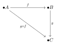
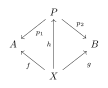
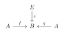
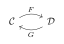
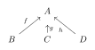
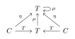

## Outline

### Introduction

- Definition of a category, objects, morphisms, composition, identity morphisms
- Examples of categories (sets, groups, topological spaces, etc.) 

### Properties of Categories

- Initial and terminal objects
- Products and coproducts 
- Equalizers and coequalizers
- Limits and colimits
- Functors and natural transformations

### Adjoint Functors
- Definition and properties
- Examples 

Universal Properties
- Definition and motivation 
- Examples (free groups, tensor products, etc)

### Yoneda Lemma
- Statement and proof
- Consequences 

### Monads
- Definition 
- Examples (maybe monad, list monad)
- Kleisli categories

### Enriched Categories
- Motivation and definition
- Examples of enriched categories

### Higher Category Theory
- Motivation 
- Definition of 2-categories and n-categories
- Examples

### Applications
- Categories in computer science (type theory, semantics)
- Categories in physics (topological quantum field theories)

#pagebreak()

# Introduction to Category Theory

\

## What is a Category? 

A category C consists of:

- A collection of objects $\text{ob}(C)$
- A collection of morphisms (also called arrows) $\text{hom}(A,B)$ between objects A and B
- A composition operation: if $f: A \to B$ and $g: B \to C$ are morphisms, then there is a composite morphism $g \circ f : A \to C$  
- An identity morphism $\text{id}_A: A \to A$ for each object

Composition must be:

- Associative: $h \circ (g \circ f) = (h \circ g) \circ f$
- Unital: $f \circ \text{id}_A = f$ and $\text{id}_B \circ f = f$

\

\

## Examples of Categories

- Set 
  - Objects are sets that satisfy the axioms of set theory:
    - Axiom of extensionality: Two sets are equal if they contain the same elements
    - Axiom of pairing: For any a and b, there exists a set {a,b} containing a and b
    - Axiom of union: For any sets A and B, there is a set C = A ∪ B containing all elements of A and B
  - Morphisms are functions between sets that map elements of one set to another

- Grp
  - Objects are groups that satisfy the group axioms:
    - Closure under an associative binary operation
    - Existence of identity element
    - Existence of inverse for each element
  - Morphisms are group homomorphisms that preserve the group structure

- Top 
  - Objects are topological spaces that satisfy the axioms of topology:
    - The union of any number of open sets is open
    - The intersection of a finite number of open sets is open
    - The empty set and the whole space are open
  - Morphisms are continuous maps between topological spaces

- Vect
  - Objects are vector spaces over a field F that satisfy: 
    - Closure under vector addition and scalar multiplication
    - Vector addition and scalar multiplication obey field axioms
  - Morphisms are linear maps that preserve vector space structure

## Intuition

Categories formalize mathematical structure and transformations that preserve that structure. The objects represent mathematical concepts, while the morphisms represent relationships between objects.
 \
 \
 \

# Properties of Categories

Categories can have additional structure and properties that reveal relationships between objects. We will explain some important properties and constructions.

\

## Initial and Terminal Objects

- An initial object is a special object that has exactly one morphism $\textit{init}_A: I \to A$ going to every other object A in the category. It is like a "source" object that every object can be mapped from in a unique way.

- A terminal object has exactly one morphism $\textit{term}_A: A \to T$ coming from every other object A. It is like a "sink" or "ending" object that everything maps to uniquely. 

- For example, in the category of sets, the empty set $\emptyset$ is initial - there is only one function $\emptyset \to A$ from the empty set to any set A. A one element set $\{*\}$ is terminal - there is only one function $A \to \{*\}$ from any set A to the one element set.

\

## Products

- The product of two objects A and B captures the idea of combining or "multiplying" A and B together. It is an object P and two morphisms $p_1: P \to A$ and $p_2: P \to B$.

- P has to satisfy a universal property: for any other object C with morphisms $f: C \to A$ and $g: C \to B$, there must be a unique morphism $h: C \to P$ that makes the whole diagram commute. This uniquely characterizes the product. 

- For example, in sets the product of A and B is their cartesian product $A \times B$. In groups it is the direct product of groups.

\

\

## Equalizers 

- An equalizer of $f,g: A \to B$ embodies the idea of $f$ and $g$ "being equal". It is an object E and morphism $e: E \to A$ such that $f\circ e = g \circ e$. So E "equalizes" f and g.

- E has a universal property like products. Intuitively, E contains elements of A that f and g map identically.

\

\

\
\
\

Here are draft sections on adjoint functors and universal properties:

# Adjoint Functors

Adjoint functors are a powerful concept in category theory that formalize a relationship between two functors.

- Two functors $F: \mathcal{C} \to \mathcal{D}$ and $G: \mathcal{D} \to \mathcal{C}$ between categories $\mathcal{C}$ and $\mathcal{D}$ are adjoints if there is a natural bijection:

$$\hom_{\mathcal{D}}(F(c),d) \cong \hom_{\mathcal{C}}(c, G(d))$$

for all objects $c \in \mathcal{C}, d \in \mathcal{D}$. 

- $F$ is called the left adjoint and $G$ the right adjoint. Intuitively, F preserves sources and G preserves sinks.

- Examples of adjoint functor pairs:
  - Free/forgetful functors between Sets and Grps
  - Hom/tensor product between vector spaces
  - Direct/inverse image functors in topology

Adjoints formalize the idea of two functors being "inverses" in a constructive way that is weaker than isomorphism. They show up often in mathematics and imply many deeper properties.

\

\

\
\
\

# Universal Properties

Many constructions in categories are defined by universal properties, which capture the essence of an object or morphism uniquely up to isomorphism.

- Products, equalizers, limits, and other concepts are defined by universal properties. These specify a mapping property that an object or morphism must satisfy.

- For example, a product $P$ of objects $A$ and $B$ has projections $p_1: P \to A$ and $p_2: P \to B$ such that for any other object $X$ with maps $f: X \to A$ and $g: X \to B$, there exists a unique map $h: X \to P$ making the diagram commute.

- Universal properties allow defining concepts intrinsically without referring to concrete representations. This is powerful for proving theorems.

- Many basic algebraic constructions are characterized by universal properties: 
  - Free groups, rings, modules
  - Tensor products
  - Kernels and images of morphisms

Universal properties abstract the key aspects of mathematical notions and their relationships. Understanding objects and morphisms via universal properties is fundamental to categorical thinking.

\
\
\

# Yoneda Lemma

The Yoneda lemma relates an object in a category to the functor it generates.

- For an object $A$ in a category $\mathcal{C}$, there is a **representable functor** $y_A: \mathcal{C} \to \mathsf{Set}$ defined by $y_A(B) = \hom(A,B)$. 

- That is, $y_A$ maps an object $B$ to the set of all morphisms from $A$ to $B$. We can visualize this mapping as:

- The Yoneda lemma states that the natural transformations from $y_A$ to any other functor $F: \mathcal{C} \to \mathsf{Set}$ are in bijection with the elements of $F(A)$.

- So the object A is uniquely determined up to isomorphism by its associated representable functor $y_A$. Objects are characterized by their mapping properties.

\

\

\
\
\

# Monads

A monad on a category $\mathcal{C}$ is a triple $(T, \eta, \mu)$:

- $T: \mathcal{C} \to \mathcal{C}$ is an **endofunctor**, mapping objects and morphisms to themselves.

- $\eta: 1_\mathcal{C} \to T$ is a **unit** natural transformation from the identity functor to T. 

- $\mu: T^2 \to T$ is a **multiplication** natural transformation, mapping from $T$ applied twice to once.

These satisfy monad axioms. Intuitively:

- T "enhances" objects in $\mathcal{C}$ 
- $\eta$ embeds an object into its T-enhanced version
- $\mu$ "flattens" double enhancement $T^2$ to single T

Examples formalize data augmentation, effects, semantics.

\

\

\
\
\

# Applications

- **Programming languages**: Category theory used in type theory, semantics. Monads in functional programming.

- **Physics**: Topological quantum field theories are functorial theories based on higher categories. 

- **Mathematics**: Category theory clarifies foundations and connections between diverse fields.

[Maths](Maths.md)
