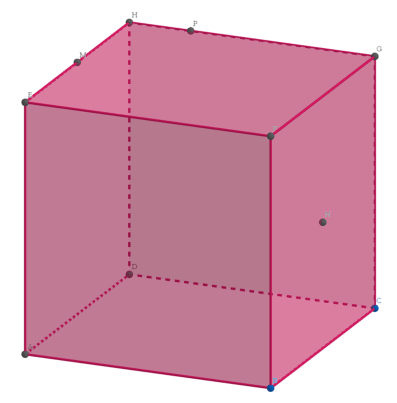
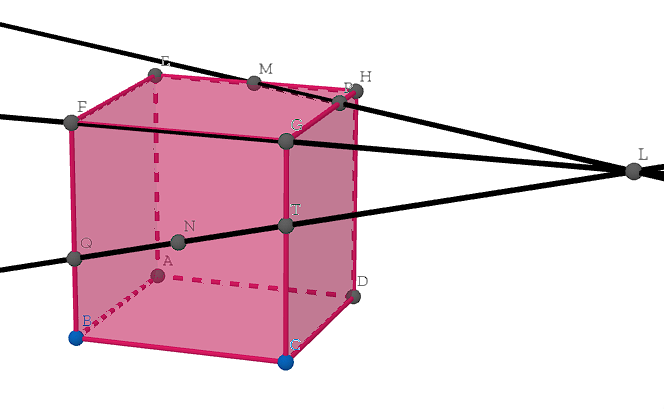
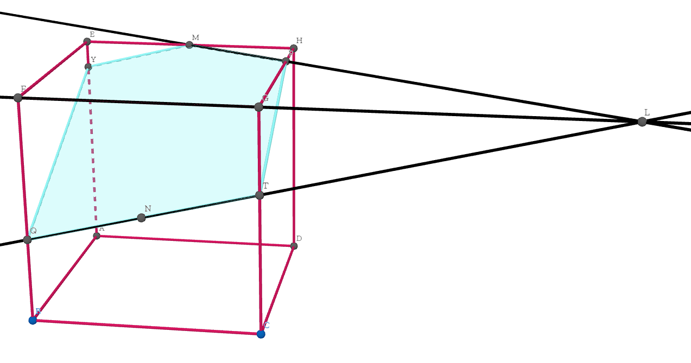

## Exercice 1 

### Partie A
1.

2. Les points $M, P, F, G$ sont coplanaires si et seulenent
si $\overrightarrow{M P}=a \overrightarrow{M F}+b \overrightarrow{M G}$ avec $(a ; b) \in \mathbb{R}^2$
\
\
$$
\begin{aligned}\overrightarrow{MP}=\overrightarrow{MH}+\overrightarrow{HP} \text{(Chasles)} \\
\overrightarrow{MP}=\dfrac{1}{2}\overrightarrow{EH}+\dfrac{1}{4}\overrightarrow{HG} \text{(Données)}\\
\overrightarrow{MF}=\overrightarrow{ME}+\overrightarrow{EF} \text{(Chasles)} \\
\overrightarrow{MF}=-\overrightarrow{EM}+\overrightarrow{HG} \text{(Car EFGH est un carré)} \\
\overrightarrow{MF}=-\dfrac{1}{2}EH+HG \text{(Données)}\\
\overrightarrow{MG}=\overrightarrow{MH}+\overrightarrow{HG} \text{(Chasles)}\\
\overrightarrow{MG}=\dfrac{1}{2}\overrightarrow{EH}+\overrightarrow{HG}\end{aligned} \text{(Données)}
$$

\
On peut transcrire le problème sous forme d'un système d'équation : \
\
systemequation $\dfrac{1}{2} = -\dfrac{1}{2}a + \dfrac{1}{2}b$ $\dfrac{1}{4}=a+b$ $\Leftrightarrow$ \
\
systemequation $\dfrac{1}{2}-\dfrac{1}{2}b=-\dfrac{1}{2}a$ $\dfrac{1}{4}-a=b$ $\Leftrightarrow$ \
\
systemequation $\dfrac{1}{2}-\dfrac{1}{2}(\dfrac{1}{4}-a)=-\dfrac{1}{2}a$ $b=\dfrac{1}{4}-a$ $\Leftrightarrow$ \
\
systemequation $a=-\dfrac{3}{8}$ $b=\dfrac{1}{4}+\dfrac{3}{8}=\dfrac{5}{8}$ \
\
$S=\left\{\left(-\frac{3}{8} ; \frac{5}{8}\right)\right\}$

\
donc $\overrightarrow{MP},\overrightarrow{MG},\overrightarrow{MF}$ sont coplanaires => M,P,E,G sont coplanaires
\

b. $(MP)$ et $(FG)$ sont parallèles si et seulement si $\overrightarrow{MP}=k\overrightarrow{FG}$ avec $k \in \mathbb{R}$
\
\
$\overrightarrow{MP} = \dfrac{1}{2}\overrightarrow{EH}+\overrightarrow{HG} \text{(Question précédente)}$
$\overrightarrow{FG}=\overrightarrow{EH} \text{(car EFGH est un carré)}$
\

On peut poser le système suivant :
\
systemequation $\dfrac{1}{2}=k$ $1=0$

ce qui est impossible
\

donc $(MP)$ et $(FG)$ ne sont pas parallèles.

### Partie B

1. On sait que $(MP)\subset(EHG)$ et $(FG)\subset (EHG)$ donc que $(MP)$ et $(FG)$ sont coplanaires
Or $(MP)$ et $(FG)$ ne sont pas parallèles d'après la question précédente et deux droites coplanaires sont soit parallèles ou sécantes
donc $(MP)$ et $(FG)$ sont sécantes en un point d'intersection $L$

\
\
$$
\begin{array}{l}
(L N) \subset(F G C) \\
(C G) \subset(F G C) \\  
\end{array}
\Rightarrow(L N) \text { et }(G C) \text { sont coplanaires }
$$

\
Or d'après la figure $(LN)$ n'est pas parallèle à $(GC)$ donc $(LN)$ et $(CG)$ sont sécantes en un point d'intersection T 
\
\

3. $\left.\begin{array}{rl}(L N) \subset(F G C) \\ (B F) \subset(F G C)\end{array}\right) \begin{aligned} & \Rightarrow(L N) \text { et }(B F) \text { sont coplanaires }\end{aligned}$
\
\

Si on considère 3 droites: $(d),\left(d^{\prime}\right),(t)$ avec $(d) \sslash \left(d^{\prime}\right)$ $s^{\prime}(t)$ est sécante à $(d)$ alors $(t)$ est sécante à $\left(d^{\prime}\right)$ Or $\left(LN\right)$ est sécante à $\left(CG\right)$ et $(C G) \sslash (B F)$ car $F G C B$ est un carré et $[G C]$ est le côté opposé à $[BF]$ Donc $(LN)$ est sécante à (BF) en un point d'intersection $Q$
\
\

\
\

b. La section $(MNP)$ de $(FGC)$ est la droite $(TQ)$ et d'après le théorème des parallèles la section pas un même plan de deux plan forment de deux droites parallèles or $(F G C) \sslash (HEA)$ donc $(Q T)$ est parallèle à la droite $(MY)$ avec $Y$ le point d'intersection entre $(EA)$ et la parallèle de $(QT)$ au point $M$.
$$
\begin{array}{l|l}
& P \in (H D C) \text { La section }(M N P) \text {de} (H G C D) {\text {est }}[T P] \\
& T \in (H D C)
\end{array}
$$
\
\
$$
\begin{aligned}
& Q \in(E F B) \\
& Y \in(E F B)
\end{aligned}
$$
donc la section $(MNP)$ de $(AEFB)$ est $[YQ]$
\

On en déduis que la section (MNP) du cube (EHGFADCB) est (MPTQY)

### Partie C 

1. $M\left(0 ; \frac{1}{2} ; 1\right) \quad N\left(1 ; \frac{1}{2} ; \frac{1}{2}\right) \quad P\left(\frac{1}{4} ; 1 ; 1\right)$ \
2. $\overrightarrow{M N}\left(\begin{array}{l}x_N-x_M \\ y_N-y_M \\ z_N-z_M\end{array}\right) \quad \overrightarrow{M N}\left(\begin{array}{c}1 \\ 0 \\ -\frac{1}{2}\end{array}\right)$ 
\ 
La longueur de $[MN]$ est égale à la norme de $\overrightarrow{M N}$ définit comme : \ 
$\|\overrightarrow{M N}\|=\sqrt{x^2+y^2+y^2}$
$$
=\sqrt{1^2+0^2+\left(-\frac{1}{2}\right)^2}
$$
$$
=\sqrt{1+\frac{1}{4}}=\frac{\sqrt{5}}{2}
$$
\
\
donc la longueur de MN est $\frac{\sqrt{5}}{2}$
\
\
3.
\
$$
\begin{aligned}
& \overrightarrow{T P}\left(\begin{array}{c}
\frac{1}{4}-1 \\
1-1 \\
1-\frac{5}{8}
\end{array}\right) \quad \overrightarrow{T P}\left(\begin{array}{c}
-\frac{3}{4} \\
0 \\
\frac{3}{8}
\end{array}\right) \\ \\
& \overrightarrow{P N}\left(\begin{array}{c}
1-\frac{1}{4} \\
\frac{1}{2}-1 \\
\frac{1}{2}-1
\end{array}\right) \quad \overrightarrow{P N}\left(\begin{array}{c}
\frac{3}{4} \\
-\frac{1}{2} \\
-\frac{1}{2}
\end{array}\right) \\ \\
& \overrightarrow{T N}\left(\begin{array}{c}
0 \\ 
-\frac{1}{2} \\
-\frac{1}{8}
\end{array}\right) 
\quad \overrightarrow{T N}\left(\begin{array}{c}
1-1 \\
\frac{1}{2}-1 \\
\frac{1}{2}-\frac{5}{8}
\end{array}\right)
\\
&
\end{aligned}
$$
\
D'après la réciproque théorème de pythagore un triangle est un traingle rectangle si et seulement si le carré de la longueur du plus grand côté est égale à la somme des carrés des autres côtés.
\
soit si $\|\overrightarrow{P N}\|^2=\|\overrightarrow{T P}\|^2+\|\overrightarrow{T N}\|^2$

$$
\begin{aligned}
(\|\overrightarrow{P N}\|)^2 &= \left(\frac{3}{4}\right)^2+\left(-\frac{1}{2}\right)^2+\left(-\frac{1}{2}\right)^2 \\
&= \dfrac{17}{16} \\
\end{aligned}
$$

$$
\begin{aligned}
(\|\overrightarrow{T P}\|)^2 + (\|\overrightarrow{T N}\|)^2 &=\left(-\frac{3}{4}\right)^2+0^2+\left(\frac{3}{8}\right)^2+0^2+\left(-\frac{1}{2}\right)^2+\left(-\frac{1}{8}\right)^2 \\
& =\frac{31}{32}\end{aligned}
$$

\
Donc TPN n'est pas un triangle rectangle

[Maths DM](Maths_DM.md)
