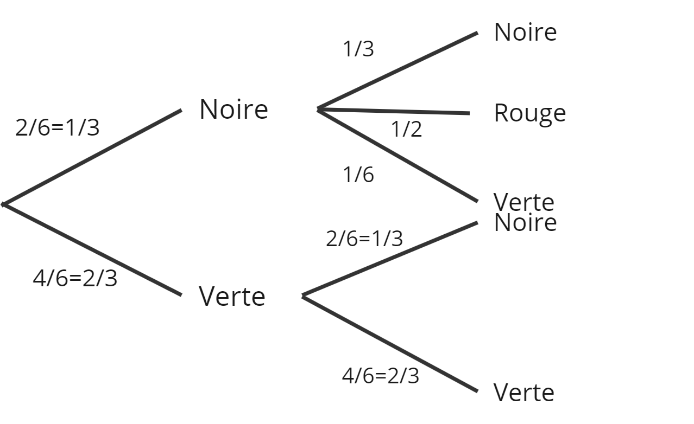

## Exercice 1

### Partie A

1. Soit $P_n$ la probabilité d'obtenir une face de couleur $n$ au premier lancer avec $n \in \{0,1,2\}$ où 0 correspond à la couleur verte, 1 à la couleur noire et 2 à la couleur rouge. Les lancers étant indépendants, la probabilité d'obtenir deux faces de couleur $n$ est $P_n^2$. On a alors :
$P_0 = \frac{2}{6} = \frac{1}{3}$
$P_1 = \frac{2}{6} = \frac{1}{3}$
$P_2 = \frac{3}{6} = \frac{1}{2}$
La probabilité d'obtenir deux faces noires est donc $P_1^2 = \frac{1}{9}$.
\
2. Notons $C$ l'événement "les deux faces obtenues sont de la même couleur". On a alors : $$P(C) = P_0^2 + P_1^2 + P_2^2 = \frac{1}{36} + \frac{1}{9} + \frac{1}{4} = \frac{7}{18}$$

3. La probabilité qu'à l'issue d'un jeu, les deux faces obtenues soient de couleurs différentes est la probabilité de l'événement contraire $\overline{C}$ qui s'obtient par : $$P(\overline{C}) = 1 - P(C) = 1 - \frac{7}{18} = \frac{11}{18}$$
4. Notons $B$ l'événement "les deux faces obtenues sont vertes" inclus dans $C$. On sait que $P(B) = P_0^2 = \frac{1}{36}$. La probabilité conditionnelle s'écrit alors : $$P_C(B) = \frac{P(B \cap C)}{P(C)} = \frac{P(B)}{P(C)} = \frac{1/36}{7/18} = \frac{1}{14}$$

### Partie B

1. a. 
b. Notons $A$ l'événement "obtenir une face verte au premier lancer" et $B$ l'événement "obtenir une face verte au second lancer". On lit sur l'arbre des probabilités : $P_A(B) = \frac{2}{3}$.\

2. La probabilité d'obtenir deux faces vertes est $P(A \cap B)= P(A)\times P_A(B)=\dfrac{2}{3}\times\dfrac{2}{3}=\dfrac{4}{9}$

3. La probabilité d'obtenir une face verte au 2ème lancer est $P(B)=P_A(B)P(A)+P_{\overline{A}}(B)P(\overline{A})=\dfrac{4}{9}+\dfrac{1}{3}\times\dfrac{1}{6}=\dfrac{1}{2}$

## Exercice 2 

1. a. Calculons les premiers termes de la suite: $u_1=\dfrac{u_0}{1+u_0}=\dfrac{1}{2}$, $u_2=\dfrac{u_1}{1+u_1}=\dfrac{1}{3}$, $u_3=\dfrac{u_2}{1+u_2}=\dfrac{1}{4}$

b.
```python
def liste(k):
  L=[]
  u=1
  for i in range(0, k+1):
    L.append(u)
    u=u/(1+u)
  return L 
```

2. Montrons par récurrence que la suite $(u_n)$ est strictement décroissante.
\
*Initialisation:*
\
Pour le rang n=0, on a
$u_1=\dfrac{1}{2}$ et $u_0=1$ soit $u_0 > u_1$ donc la propriété est vraie au rang n=0.
\
*Hérédité:*
\
On suppose qu'il existe un entier naturel k tel que $u_{k+1}<u_k$.
Montrons que la propriété est vraie au rang $n=k+1$.
On pose la fonction f qui à x renvoie $\dfrac{x}{1+x}$ définie et dérivable sur $[0;+\infty[$ en dérivant f on obtient $f'(x)=\dfrac{1}{(1+x)^2}$ or $(1+x)^2 >0$ pour $x \geq 0$ donc $f'(x)>0$ sur $[0;+\infty[$ donc f est croissante sur ce même intervalle on peut donc composer par f.
$f(u_{k+1})<f(u_k)$
$u_{k+2}<u_{k+1}$
Donc la propriété est héréditaire.
\
*Conclusion:* \
$\forall n \in \mathbb{N}$, $u_{n+1}<u_{n}$, la suite $(u_n)$ est strictement décroissante.

3. Montrons que la suite $(u_n)$ converge:

La suite $(u_n)$ est strictement décroissante d'après la question précédente. De plus la suite $(u_n)$ est minorée par 0 puisque $\forall n \in \mathbb{N} \ u_n>0$ d'après l'énoncé.

Or, toute suite strictement décroissante et minorée converge vers un réel l d'après le théorème 4.2 du cours sur la convergence des suites monotones.

4. $\lim_{n \to +\infty} u_{n+1} = \lim_{n \to +\infty} u_n = l$ d'après la convergence de la suite. Donc $l = \dfrac{l}{1+l}$ 
$l-\dfrac{l}{1+l}=0$
\
$\dfrac{l+l^2-l}{1+l}=0$
\
\
$\dfrac{l^2}{1+l}=0$ \
\
$\Leftrightarrow$
systemequation $l^2=0$ $1+l\neq 0$ \
\
$\Leftrightarrow$
systemequation $l=0$ $l\neq -1$ \
Or $l>0$ d'après l'énoncé donc $l=0^+$ soit la $\lim_{n \to +\infty} u_{n+1} = \lim_{n \to +\infty} u_n = 0^+$

5. a. On conjecture à partir des premiers termes de la suite que $u_n = \dfrac{1}{n+1}$.

b. Soit la proposition $P_n : u_n=\dfrac{1}{n+1}$
\
Montrons que $P_n$ est vraie pour tout entier naturel n par récurrence:
\
Initialisation: 
\
pour $n=0$ on a $\dfrac{1}{n+1}={1}{1}=1$ et $u_n=u_0=1$ donc la propriété $P_0$ est vraie.
\
Hérédité:
\
On suppose qu'il existe un entier naturel k tel que $u_k=\dfrac{1}{k+1}$
\
Montrons que $P_k+1$ est vraie:
\
$u_{k+1}=\dfrac{u_k}{u_k +1}$ \
\
$u_{k+1}=\dfrac{1}{k+1}\dfrac{k+1}{k+2}$
\
\
$u_{k+1}=\dfrac{1}{k+2}$ \
Donc la propriété $P_n$ est héréditaire
\
Conclusion:
\
$\forall n \in \mathbb{N} \ u_n=\dfrac{1}{n+1}$ \
La conjecture est bien démontrée

## Exercice 3
\
1. (IJ) est sécante avec (AB) en le point d'intersection J et (AB)//(EF) car [AB] et [EF] sont des faces opposées du cube donc (IJ) est sécante avec (EF) en un point d'intersection P. Or, $(EF) \subset (EFG)$, donc (IJ) coupe le plan (EFG) au point d'intersection P

2. $K \in (EFG)$ et $K \in (IJ) \subset (IJK)$, $P \in (EFG)$ et $P\in (IJ)\subset (IJK)$ donc l'intersection des plans (IJK) et (EFG) est la droite (PK)

3. La section $(IJK)$ de $(ABF)$ est la droite $(IJ)$ et d'après le théorème des parallèles la section par un même plan de deux plan forment deux droites parallèles or $(ABF) \sslash (DCG)$ donc $(IJ)$ est parallèle à la droite $(KR)$ avec $R$ le point d'intersection entre $(GC)$ et la parallèle de $(IJ)$ au point $K$.
La section $(IJK)$ de $(EFG)$ est la droite $(PK)$ donc la section de la face $EFGH$ par le plan $(IJK)$ est le segment $[SK]$ avec $S$ le point d'intersection entre $(PK)$ et $(EH)$ d'après le théorème des parallèles la section par un même plan de deux plan forment deux droites parallèles or $(EFG) \sslash (ABC)$ donc $(SK)$ est parallèle à la droite $(JQ)$ avec $Q$ le point d'intersection entre $(BC)$ et la parallèle de $(SK)$ au point $J$. De plus $S \in (IJK) \text{et} S\in (HE) \subset (HEA)$ de même $I\in (IJK) \text{et} I\in (EA) \subset (HEA)$ par conséquent $[SI]$ est la section de la face $HEAD$ par le plan $(IJK)$. Finalement $R \in (GC) \subset (BCG) \text{et} R \in (IJK)$ de même $Q \in (BC) \subset (BCG) \text{et} Q \in (IJK)$ par conséquent $[RQ]$ est la section de la face $FGCB$ par le plan $(IJK)$. Par conséquent la section du cube $ABCDEFGH$ par le plan $(IJK)$ est l'hexagone $IJQRKS$


## Exercice 4
\
Considérons la fonction $f$ tel que $f(x)=\dfrac{x}{(x-1)^2+x}=\dfrac{x}{x^2-x+1}$ définie et dérivable sur l'intervalle $[2;2,1]$ \
Étudions la variation de $f$:\
La dérivée de $f$ est $f'(x)=\dfrac{1-x^2}{(x^2-x+1)^2}$\
Pour $x \in [2;2,1]$, $x>1 \Rightarrow x^2>1$ On en déduit que $-x^2< -1 \Rightarrow 1-x^2<0$\
Enfin $(x^2-x+1)^2>0$, $\forall x \in \mathbb{R}$ donc $\dfrac{1-x^2}{(x^2-x+1)^2}<0$\
Soit $f'(x)<0$ sur l'intervalle $[2;2,1]$ autrement dit f est décroissante sur $[2;2,1]$.\
Soient $a=2,014014014014$ et $b=2,014014014016$\
Puisque $a<b$, on a $f(a)>f(b)$ en composant par la fonction f\
Or $f(a)=A$ et $f(b)=B$ donc $A>B$\
En conclusion A est plus grand que B

