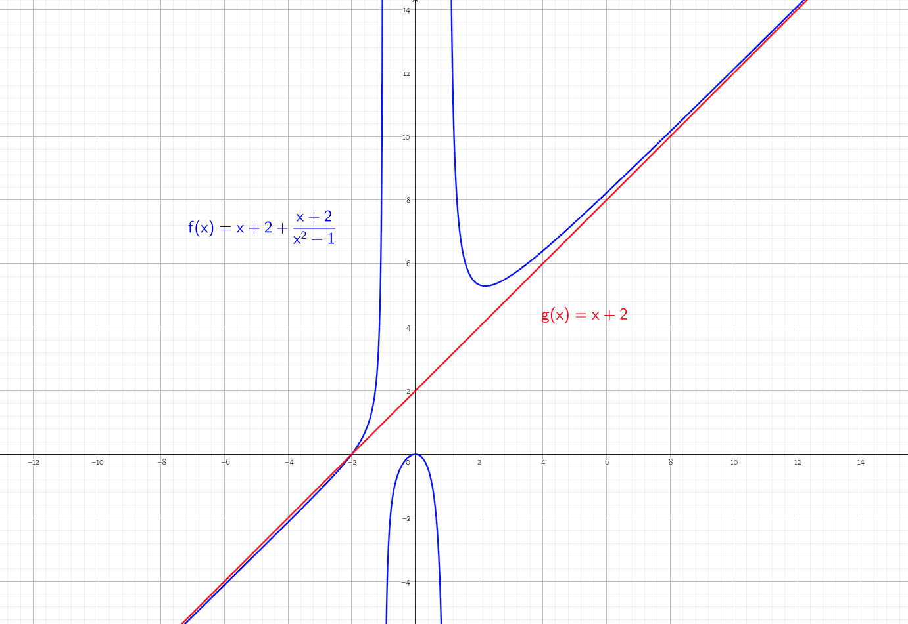
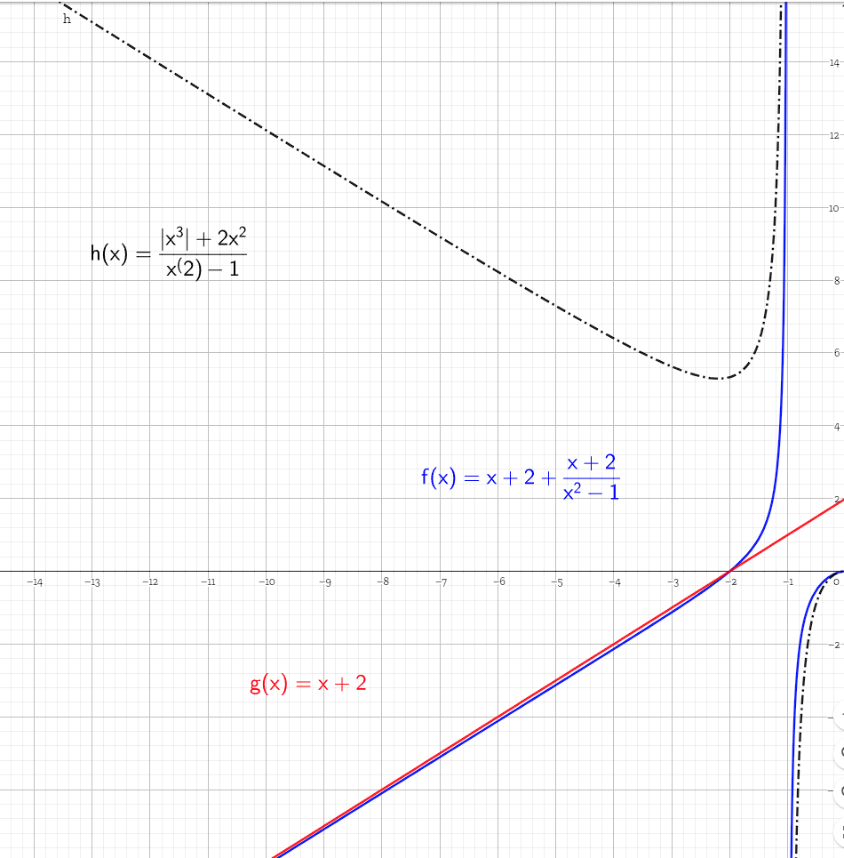

## Rédacteur Lucas Duchet-Annez 
## Exercice 1

### Partie A

On sait que $(Cf)$ admet deux asymptotes d'équations $x=1$ et $x=-1$ cela veut dire que $f$ n'est pas définie quand $x=1$ ou $x=-1$ or f est une fonction rationnelle définie tant que son dénominateur est différent de 0 soit quand $x^2-c\neq 0$ Donc $c=(1)^2$ ou $c=(-1)^2$ soit $c=1$.

$$f(x)-(x+2)=\frac{ax^3+bx^2}{x^2-1}-x-2$$
$$= \frac{(a-1)x^3 + (b-2)x^2 + x + 2}{x^2-1}$$
$$= \frac{x^3(a-1+\frac{b-2}{x}+\frac{1}{x^2}+\frac{2}{x^3})}{x^2(1-\frac{1}{x^2})}$$
$$= x \frac{a-1+\frac{b-2}{x}+\frac{1}{x^2}+\frac{2}{x^3}}{1-\frac{1}{x^2}}$$
On sait que $lim_{x \to +\infty} \dfrac{1}{x^k}=0$ donc $lim_{x\to +\infty} a-1+\dfrac{b-2}{x}+\dfrac{1}{x^2}+\dfrac{2}{x^3}=a-1$ et $lim_{x\to +\infty} 1-\dfrac{1}{x^2}=1$
De plus $lim_{x\to +\infty} x = +\infty$ Donc $lim_{x\to +\infty} f(x)-(x+2)=lim_{x\to +\infty} x(a-1) = 0$

Pour que la limite soit 0 il faut que $a-1=0$ soit $a=1$

Finalement On peut noter 
$$f(x)-(x+2)=x\dfrac{1-1+\dfrac{b-2}{x}+\dfrac{1}{x^2}+\dfrac{2}{x^3}}{1-\dfrac{1}{x^2}}$$
$$=\dfrac{\dfrac{b-2}+\dfrac{1}{x}+\dfrac{2}{x^2}}{1-\dfrac{1}{x^2}}$$

A nouveau $\dfrac{1}{x}$ et $\dfrac{1}{x^2}$ tendent vers $0$ lorsque $x$ tend vers $+\infty$. Par conséquent on obtient 
$lim_{x\to +\infty} f(x)-(x+2)=lim_{x\to +\infty} b-2 = 0$ Donc $b=2$

### Partie B

1. Pour étudier les variations de $g$ on analyse le signe de sa dérivée.
$g'(x)=3x^2-3$
$g'(x)>0$
$3x^2-3>0$
$x^2>\dfrac{3}{3}$
$x^2>1$
$x>1$ ou $x<-1$

Pour calculer les limites de $g$ on factorise par le terme prépondérant.
$g(x)=x^3(1-\dfrac{3}{x^2}-\dfrac{4}{x^3})$
On sait que $\lim_{x\to +\infty} \dfrac{1}{x^k}=0$ donc $\lim_{x\to +\infty} 1-\dfrac{3}{x^2}-\dfrac{4}{x^3} = 1$ et $\lim_{x\to +\infty} x^3 = +\infty$. Par conséquent $\lim_{x\to +\infty} g(x)=+\infty$ et de manière analogue $\lim_{x\to -\infty} g(x)=-\infty$
On en déduit

| x     | -∞ |   | -1    |   | 1    |   | +∞ |
|-------|----|---|-------|---|------|---|----|
|signe de g'(x) |    | + | 0     | - | 0    | + |    |
|var de  g     | -∞ | ➚ | g(-1)=-2 | ➘ | g(1)=-6 | ➚ | +∞ |

2. 
    a. On peut étudier chaque intervalle à l'aide du théorème des valeurs intermédiaires. Premièrement g est une fonction polynomiale donc définie et dérivable sur $\mathbb{R}$, par conséquent g est une fonction continue sur $\mathbb{R}$. Sur l'intervalle $]-\infty; -1]$ g est croissante et $\lim_{x\to -\infty} g(x) = -\infty$, $g(-1)=-2$ donc $(Cg)$ ne coupe pas l'axe des abscisses et l'équation $g(a)=0 (E)$ n'as pas de solution de manière analogue sur $[-1;1]$ g est décroissante et comme $g(-1)<0$ $(E)$ n'as pas non plus de solution. Finalement sur $[1;+\infty[$ g est croissante et $\lim_{x\to +\infty} g(x)=+\infty>0$, $g(1)=-6<0$ Donc d'après le théorème des valeurs intermédiares $(E)$ a une unique solution sur l'intervalle $[1;+\infty[$
    b. $g(2.19)=-0.066541$ et $g(2.20)=0.048$ ce qui veut dire que $g(2.19)<a<g(2.20)$ soit d'après le théorème des valeurs intermédiares $2.19<a<2.20$

3. $g(x)>0$
   $x^3-3x-4>0$
   $x>a$
   On en déduit le tableau suivant
    
     x     | -∞ |   | a |   | +∞ |
    |-------|----|---|---|---|----|
    |signe de g(x)| |-|0|+|||

### Partie C

1. $f$ est définie quand son dénominateur est différent de $0$ soit quand $x^2-1\neq 0$ donc quand $x\neq 1$ et $x\neq -1$ donc $D_f=\mathbb{R} \setminus \{-1;1\}$ 
De plus $f(x)=\dfrac{u(x)}{v(x)}$ avec $u(x)=x^3+2x^2$ et $v(x)=x^2-1$ donc son ensemble de dérivabilité est $D_{f'}=\mathbb{R} \setminus \{-1;1\}$ car $v$ n'est pas définie quand $x=1$ et $x=-1$

2. f satisfait les conditions de la partie A car $f(0) = \dfrac{0^3+2(0^2)}{0^2-1}=0$
donc f passe par l'origine. De plus $f$ n'est pas définie en $-1$ et $1$ comme dans la partie A et la limite de $f(x)-(x+2)=\dfrac{x^3+2x^2-x^3+x-2x^2+2}{x^2-1}=\dfrac{1+\dfrac{2}{x^2}}{x(1-\dfrac{1}{x^2})}$ Or $\lim_{x\to +\infty} \dfrac{1}{x^k} = 0$ donc $\lim_{x\to +\infty} f(x)-(x+2) =0$ et de manière analogue $\lim_{x\to -\infty} f(x)-(x+2) =0$

3. 
    a. $f'(x) = \dfrac{(x^2-1)(3x^2+4x)-2x(x^3+2x^2)}{(x^2-1)^2}=\dfrac{x^4-3x^2-4x}{(x^2-1)^2}=\dfrac{xg(x)}{(x^2-1)^2}$

    b. 

$\lim_{x\to (-1)^-} f(x) = +\infty$ car $x<-1$
$x^2>1$ car $x^2$ est décroissante sur $\mathbb{R}^{-}$
$x^2-1>0$

et de manière analogue $\lim_{x\to (-1)^+} f(x) = -\infty$ car $x>-1$
$x^2<1$ car $x^2$ est décroissante sur $\mathbb{R}^{-}$
$x^2-1<0$

De plus $\lim_{x\to 1^+} f(x) = +\infty$ car $x>1$
$x^2>1$ car $x^2$ est croissante sur $\mathbb{R}^{+}$
$x^2-1>0$
Finalement 
$\lim_{x\to 1^-} f(x) = -\infty$ car $x<1$
$x^2<1$ car $x^2$ est croissante sur $\mathbb{R}^{+}$
$x^2-1<0$

| x              | -∞  |   | -1   |   | 0 |   | 1    |   | +∞  |
|----------------|-----|---|------|---|---|---|------|---|-----|
| signe de xg(x) |     | + |      | + | 0 | - |      | - |     |
| var de f       | x+2 | ➚ | \|\| | ➚ | 0 | ➘ | \|\| | ➘ | x+2 |

4. 
    a. $x+2+\dfrac{x+2}{x^2-1}=\dfrac{x+2+(x+2)(x^2-1)}{x^2-1}=\dfrac{x+2-2-x+x^3+2x^2}{x^2-1}=f(x)$
    b. Par conséquent $f(x)-(x+2) = \dfrac{x+2}{x^2-1}$ Donc quand x tend vers $-\infty$ $(Cf)$ sera légèrement en dessous de $\Delta$ et inversement quand x tend vers $+\infty$

5. 

### Partie D

## Exercice 3

