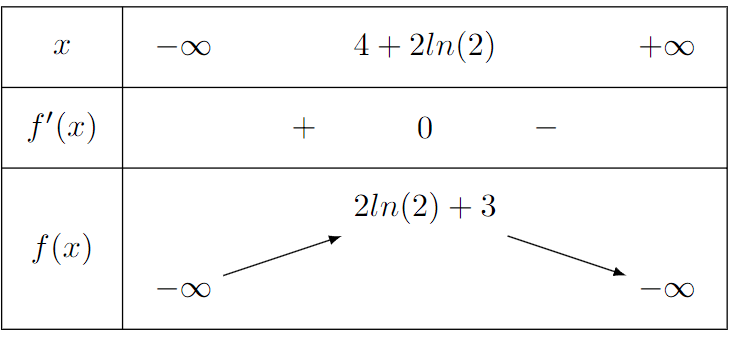

## Exercice 1

#### Question 1
b.

#### Question 2
a.

#### Question 3
c.

#### Question 4
b.

#### Question 5
b.

#### Question 6
b.

## Exercice 2

### Partie A

1. 
    a. $$ lim_{x \to -\infty} x = -\infty$$ 
    $$ lim_{x \to -\infty} 0.5x-2= -\infty$$
    $$ lim_{x \to -\infty} e^{0.5x-2}= lim_{X to -\infty} e^X = 0$$
    $$ lim_{x \to -\infty} 1+x-e^{0.5x-2}=-\infty$$
    b.  
    $$f(x)= 1+x+e^{0.5x-2}=1+0.5x(2-2e^{0.5x-2})=1+0.5x(2-\frac{e^{0.5x}}{0.5x}\times e^{-2})$$ 

2. a. 

$$f(x)=1+x-e^{X}$$
$$f'(x)=1-X'(x)e^{X}$$
$$X(x)=0.5x-2$$
$$X'(x)=0.5$$
$$f'(x)=1-0.5(e^{0.5x-2})$$
b.$$1-0.5(e^{0.5x-2})<0$$
$$-0.5(e^{0.5x-2})<-1$$
$$e^{0.5x-2}>2$$
$$0.5x-2>ln(2)$$
$$x>2(ln(2)+2)$$
$$x>4+2ln(2)$$

Donc $f'(x)<0$ quand $x\in ]4+2ln(2); +\infty[$

3.

4.
On montre que la fonction $f(x)=1+x-e^{0.5x-2}$ est continue sur l'intervalle $[-1;0]$.

La fonction $x\mapsto 1+x$ est continue sur $\mathbb{R}$. La fonction $x\mapsto e^{0.5x-2}$ est continue sur $\mathbb{R}$ car c'est une fonction exponentielle. La somme, la composition et la multiplication de fonctions continues sont continues, donc $f(x)=1+x-e^{0.5x-2}$ est continue sur $\mathbb{R}$.

En particulier, $f(x)$ est continue sur $[-1;0]$.

D'après le tableau de variation $f(x)$ est croissante sur $[-1;0]$ car $0<4+2ln(2)\approx 5.4$
Finalement $f(0)=1-e^{-2}\approx 0.9$ et $f(1)=2-e^{-1.5}\approx -0.08$
Donc $0\in [1-e^{-2};2-e^{-1.5}]$

Selon le théorème des valeurs intermédiaires l'équation $f(x)=0$ a une unique solution sur l'intervalle $[-1;0]$

### Partie B

1. a.
