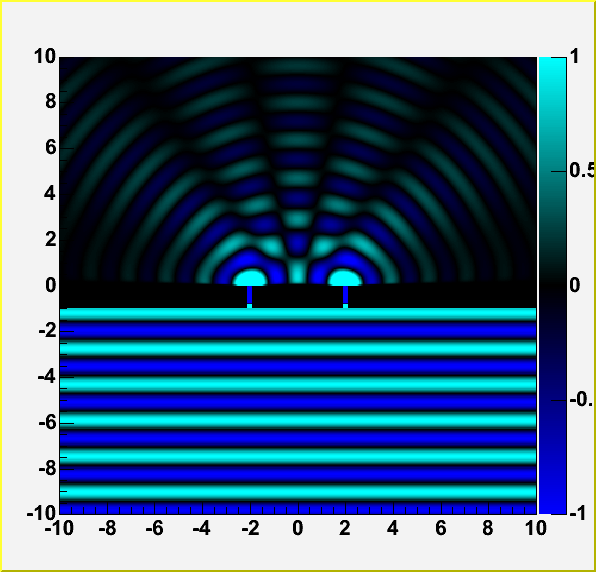
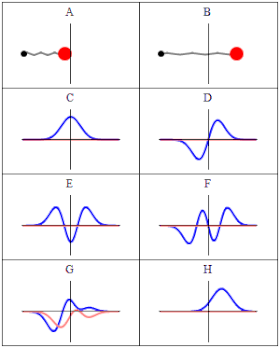

# Introduction

La mécanique quantique est une théorie fondamentale de la physique qui
décrit les propriétés physiques de la nature à l’échelle des atomes et
des particules subatomiques. Elle est le fondement de toute la physique
quantique, y compris la chimie quantique, la théorie quantique des
champs, la technologie quantique et la science de l’information
quantique.

La mécanique quantique diffère de la physique classique à bien des
égards, notamment :

-   La quantification : en mécanique quantique, l’énergie, la quantité
    de mouvement, le moment angulaire et d’autres quantités sont souvent
    limités à des valeurs discrètes.

-   La dualité onde-particule : les objets ont des caractéristiques à la
    fois de particules et d’ondes.

-   Le principe d’incertitude : étant donné un ensemble complet de
    conditions initiales, il existe des limites à la précision avec
    laquelle la valeur d’une quantité physique peut être prédite avant
    sa mesure.

-   L’intrication quantique : des objets peuvent être liés entre eux de
    telle sorte qu’ils partagent le même destin, même s’ils sont séparés
    par une grande distance.

La mécanique quantique a joué un rôle important dans le développement de
nombreuses technologies modernes, notamment les lasers, les transistors
et les armes nucléaires. Elle est également essentielle pour comprendre
de nombreux processus fondamentaux dans la nature, tels que le
comportement des atomes et des molécules, la structure des matériaux et
la nature de la lumière. Ce cours propose une introduction aux concepts
de base de la mécanique quantique. Nous discuterons de la fonction
d’onde, de l’équation de Schrödinger et du principe d’incertitude. Nous
aborderons aussi certaines applications de la mécanique quantique,
telles que les lasers et les transistors.

# Cours associés

-   [Mécanique de Lagrange](lagrange.pdf)

-   [La théorie des champs quantiques](champs_quantiques.pdf)

# Histoire

## Quanta 

Un quanta est la plus petite unité d’énergie pouvant être absorbée ou
émise. C’est la particule fondamentale de la lumière, et c’est aussi
l’énergie transportée par d’autres particules, telles que les électrons
et les protons.

L’histoire de la découverte des quanta est longue et sinueuse. Le
premier soupçon d’existence d’un quanta est apparu au début des années
1900, lorsque les physiciens étudiaient le comportement de la lumière.
Ils ont découvert que la lumière pouvait être émise en unités discrètes
et que ces unités étaient proportionnelles à la fréquence de la lumière.
Cette découverte a conduit au développement de la théorie quantique, qui
est la branche de la physique qui traite du comportement de la matière
et de l’énergie au niveau atomique et subatomique.

La théorie quantique a révolutionné notre compréhension de l’univers et
a conduit au développement de nombreuses nouvelles technologies, telles
que les lasers et l’énergie nucléaire. Il s’agit toujours d’un domaine
de recherche actif, et les scientifiques apprennent constamment de
nouvelles choses sur le fonctionnement des quanta.

Le terme “quanta” a été utilisé pour la première fois en 1905 par Max
Planck, un physicien allemand. Planck essayait d’expliquer le spectre de
rayonnement du corps noir, c’est-à-dire la distribution de l’énergie
émise par un corps noir à différentes longueurs d’onde. Il a découvert
qu’il ne pouvait expliquer le spectre que s’il supposait que la lumière
était émise en unités discrètes, qu’il a appelées quanta.

## Dualité onde-corpuscule

La dualité onde-particule est le concept de la mécanique quantique selon
lequel toute particule ou entité quantique peut être décrite soit comme
une onde, soit comme une particule. Elle exprime l’incapacité des
concepts classiques de “particule” ou d’“onde” à décrire pleinement le
comportement des objets à l’échelle quantique. Comme l’a écrit Albert
Einstein : “Il semble que nous devions utiliser tantôt l’une, tantôt
l’autre théorie, et tantôt l’une ou l’autre. Nous sommes confrontés à un
nouveau type de difficulté. Nous avons deux images contradictoires de la
réalité ; séparément, aucune d’entre elles n’explique totalement les
phénomènes lumineux, mais ensemble, elles le font.

La dualité onde-particule a été découverte pour la première fois par le
physicien français Louis de Broglie en 1924. De Broglie a proposé que
toutes les particules aient une longueur d’onde, et que cette longueur
d’onde soit inversement proportionnelle à l’élan de la particule. En
d’autres termes, plus la longueur d’onde est courte, plus l’élan de la
particule est important.

L’hypothèse de De Broglie a été confirmée par l’expérience de
Davisson-Germer en 1927. Dans cette expérience, un faisceau d’électrons
a été diffusé à partir d’un cristal. On a constaté que les électrons
interféraient les uns avec les autres, comme le feraient des ondes.
Cette expérience a confirmé que les électrons peuvent se comporter comme
des ondes.

La dualité onde-particule est l’un des concepts les plus importants de
la mécanique quantique. Elle est à la base de nombreux effets étranges
observés dans le monde quantique, tels que l’effet tunnel quantique et
l’intrication quantique.

<figure>

<figcaption>
Image d’une onde dans l’expérience de la double
fente
</figcaption>
</figure>

Cette image montre comment une onde peut interférer avec elle-même. Les
ondes sont représentées par les lignes bleues. Les zones bleu clair
représentent les zones où les ondes sont en phase, et les zones bleu
foncé représentent les zones dans lesquelles les ondes sont déphasées.
Comme vous pouvez le voir, les ondes peuvent interférer les unes avec
les autres pour créer des motifs clairs et sombres.

C’est un bon exemple de la façon dont les ondes peuvent se comporter
comme des particules. Les ondes de cette image sont en fait des
électrons qui interfèrent les uns avec les autres pour créer un motif.
Ce n’est qu’un exemple de la manière dont la dualité onde-particule se
manifeste dans le monde quantique.

## Le problème de la mesure

Le problème de la mesure est un problème fondamental de la mécanique
quantique. Il s’agit de réconcilier la fonction d’onde d’un système
quantique avec les résultats des mesures classiques. La fonction d’onde
d’un système quantique est une fonction mathématique qui décrit l’état
du système. Les résultats des mesures sont les valeurs que nous
observons lorsque nous mesurons le système.

L’effondrement de la fonction d’onde est le processus par lequel la
fonction d’onde d’un système quantique change lorsqu’elle est mesurée.
La fonction d’onde s’effondre en un seul état, et on dit que le système
est dans un état propre. L’état propre est l’état qui correspond au
résultat de la mesure.

Le problème de la mesure a été proposé pour la première fois par Niels
Bohr en 1928. Bohr a soutenu que l’effondrement de la fonction d’onde
est une conséquence nécessaire de l’interaction du système quantique
avec l’appareil de mesure. L’appareil de mesure est un système
classique, et il ne peut pas interagir avec le système quantique sans le
perturber.

Il existe de nombreuses interprétations différentes de la mécanique
quantique et chaque interprétation a sa propre façon d’expliquer le
problème de la mesure. L’interprétation la plus populaire de la
mécanique quantique est l’interprétation de Copenhague. Selon cette
interprétation, l’effondrement de la fonction d’onde est un événement
réel, qui se produit lorsque le système quantique interagit avec
l’appareil de mesure.

## Intrication quantique

L’intrication est un phénomène dans lequel deux ou plusieurs particules
quantiques sont liées de telle sorte qu’elles partagent le même destin,
même lorsqu’elles sont séparées par une grande distance. Par exemple, si
deux électrons sont intriqués, ils auront toujours le même spin, même
s’ils sont séparés par un continent.

L’intrication a été découverte pour la première fois par Albert
Einstein, Boris Podolsky et Nathan Rosen en 1935. Ils ont proposé une
expérience consistant à séparer une paire de particules intriquées et à
mesurer leurs propriétés. Ils ont constaté que les propriétés des
particules étaient toujours corrélées, même si elles étaient séparées
par une grande distance. Cette expérience a montré que l’intrication est
un phénomène réel, qui a depuis été confirmé par de nombreuses autres
expériences.

Cependant, il est important de noter que l’intrication ne peut pas être
utilisée pour communiquer des informations à une vitesse supérieure à
celle de la lumière. En effet, l’information partagée entre les
particules intriquées n’est pas réellement transmise entre elles. Au
lieu de cela, les particules se trouvent simplement dans un état dans
lequel elles partagent le même destin.

# Fondements mathématiques de la mécanique quantique 

## Fonction d’onde 

La fonction d’onde est une fonction mathématique qui décrit l’état d’un
système quantique. Il s’agit d’une fonction à valeurs complexes, dont le
carré donne la probabilité de trouver la particule en un point
particulier de l’espace. La fonction d’onde peut être utilisée pour
calculer l’énergie de la particule, sa quantité de mouvement et d’autres
propriétés.

Un exemple de fonction d’onde est la fonction d’onde d’une particule
dans une boîte. Cette fonction d’onde est une onde sinusoïdale dont la
longueur d’onde et l’amplitude varient en fonction de l’énergie de la
particule. Le carré de la fonction d’onde d’une particule dans une boîte
donne la probabilité de trouver la particule en un point particulier de
la boîte.

Un autre exemple de fonction d’onde est la fonction d’onde d’un électron
libre. Cette fonction d’onde est une onde sphérique dont la longueur
d’onde et l’amplitude varient en fonction de l’énergie de l’électron. Le
carré de la fonction d’onde d’un électron libre donne la probabilité de
trouver l’électron en un point particulier de l’espace.

La fonction d’onde est un concept très important en mécanique quantique,
et elle a de nombreuses applications dans la théorie des ondes et des
particules. En comprenant la fonction d’onde, nous pouvons mieux
comprendre le comportement des systèmes quantiques.

Voici un exemple de fonction d’onde pour une particule dans une boîte :

$\psi(x) = \sqrt{\frac{2}{L}}\sin\left( \frac{\pi nx}{L} \right)$

où $n$ est un entier et $L$ la longueur de la boîte. La longueur d’onde
de cette fonction d’onde est $\lambda = 2\frac{L}{n}$, et l’amplitude
est $A = \sqrt{\frac{2}{L}}$. Le carré de cette fonction d’onde donne la
probabilité de trouver la particule en un point particulier de la boîte.

<figure>

<figcaption>
Representation de fonction d’onde
</figcaption>
</figure>

## Espaces de Hilbert et vecteurs d’état 

La mécanique quantique est une théorie mathématique qui utilise des
*espaces de Hilbert* pour représenter les **états quantiques d’un
système**. Un *espace de Hilbert* est un **espace vectoriel complexe**
avec une structure interne qui permet de définir une notion de distance
et de convergence, nommé produit interne. Les *vecteurs d’état*
quantique sont des éléments de cet espace de Hilbert et représentent
l’état quantique d’un système. Les vecteurs d’état sont généralement
notés **\|ψ⟩** et peuvent être exprimés comme une **combinaison linéaire
de vecteurs de base appelés états propres**.

### Produit Scalaire (Produit interne) 

Le produit scalaire correspond pour deux vecteurs de taille n
$\overset{\rightarrow}{u}\begin{pmatrix}
x_{1} \\
x_{2} \\
.. \\
x_{n}
\end{pmatrix}x_{i} \in {\mathbb{C}}$ et
$\overset{\rightarrow}{v}\begin{pmatrix}
y_{1} \\
x_{2} \\
.. \\
y_{n}
\end{pmatrix}y_{i} \in {\mathbb{C}}\ \,$ à

$\langle u|v\rangle = \sum_{i = 1}^{n}x_{i}^{*}y_{i} \in {\mathbb{C}}$

avec \* le conjugué

#### Linéarité et anti-linéarité 

Le produit scalaire est linéaire à droite et anti-linéaire à gauche  

-   $\langle u|v_{1} + v_{2}\rangle = \langle u|v_{1}\rangle + \langle u|v_{2}\rangle$

-   $\langle u_{1} + u_{2}|v\rangle = \langle u_{1}|v\rangle + \langle u_{2}|v\rangle$

-   $\langle u|\lambda v\rangle = \lambda\langle u|v\rangle$

-   $\langle u|\lambda v\rangle = \lambda\langle u|v\rangle\lambda \in {\mathbb{C}}$

-   $\langle\lambda u|v\rangle = \lambda^{*}\langle u|v\rangle\lambda \in {\mathbb{C}}$

Ex.

-   $\langle u|(2 + 3i)v\rangle = (2 + 3i)\langle u|v\rangle$

-   $\langle(2 + 3i)u|v\rangle = (2 - 3i)\langle u|v\rangle$

#### Norme 

$\overset{\rightarrow}{u}\begin{pmatrix}
x_{1} \\
x_{2} \\
.. \\
x_{n}
\end{pmatrix}\|\overset{\rightarrow}{u}\| = \sqrt{\sum_{i = 1}^{n} = |x_{i}^{2}|} \in {\mathbb{R}}_{+}$
avec \|x\| le module de x soit pour un nombre complexe $z = a + ib$ le
module de z est $$|z| = \sqrt{a^{2} + b^{2}}$$ par conséquent
$$\|\overset{\rightarrow}{u}\|^{2} = |x_{1}|^{2} + |x_{2}|^{2} + .. + |x_{n}|^{2}$$
puisque $|z\,|^{2} = a^{2} + b^{2} = z^{*} \cdot z \rightarrow .$
$$\| u\| = \sqrt{\langle u|u\rangle}$$

#### Orthogonalité 

Deux vecteurs sont orthogonaux si $\langle u|v\rangle = 0$

#### Symétrie 

$$\langle u|v\rangle = \left( \langle v|u\rangle \right)^{*}$$

## Opérateurs et observables 

Les *opérateurs quantiques* sont des **transformations linéaires** qui
agissent sur les vecteurs d’état quantique pour produire de nouveaux
vecteurs d’état. Les *observables* sont des grandeurs physiques qui
peuvent être mesurées expérimentalement, telles que la **position**, la
**quantité de mouvement** et l’**énergie**. Les observables sont
représentées par des *opérateurs hermitiens*. Les valeurs propres de ces
opérateurs sont les valeurs possibles pour les mesures de l’observable
correspondante.

### Opérateurs linéaires

Un opérateur linéaire est une fonction $L$ qui fait correspondre des
vecteurs d’un espace vectoriel $V$ à des vecteurs d’un autre espace
vectoriel $W$, de telle sorte que pour tout vecteur $x$ et $y$ dans $V$
et tout scalaire $c$,

$\hat{L}(\left| x\rangle + \right|y\rangle) = \hat{L}(|x\rangle) + \hat{L}(|y\rangle)$
$\hat{L}(c|x\rangle) = c\hat{L}(|x\rangle)$

La notation d’un opérateur linéaire est généralement un chapeau,
$\hat{L}$. Par exemple, l’opérateur linéaire qui prend un vecteur $x$ à
sa transposée est désigné par $\hat{T}$.

En mécanique quantique, les opérateurs linéaires sont utilisés pour
représenter les observables. Par exemple, l’opérateur linéaire qui
représente la position d’une particule est désigné par $\hat{x}$. La
formule de la valeur espérée d’une observable $O$ est donnée par

$\langle O\rangle = \int\psi^{*}O\psi dx$

où $\psi$ est la fonction d’onde de la particule.

### États propres et valeurs propres

Un observable est une quantité qui peut être mesurée dans un système
quantique. Les observables ont des valeurs propres, qui sont les valeurs
possibles que l’observable peut prendre. Les états propres sont les
états d’un système quantique qui correspondent aux valeurs propres d’un
observable.

Les trois règles concernant les états propres et les valeurs propres des
observables sont les suivantes :

1.  Les observables ont des valeurs propres réelles.

2.  Les états propres des observables doivent couvrir tout l’espace
    vectoriel.

3.  Les états propres doivent être mutuellement orthogonaux.

**Exemple**:

Énergie potentielle

L’énergie potentielle d’un système quantique est l’énergie que le
système possède en raison de sa position. L’opérateur d’énergie
potentielle est désigné par $\hat{V}$.

La formule de l’énergie potentielle est donnée par

$\hat{V} = - \frac{\hslash^{2}}{2m}\nabla^{2}$

où $\nabla^{2}$ est l’opérateur Laplacien.

L’opérateur d’énergie potentielle peut être utilisé pour trouver les
valeurs propres et les états propres de l’atome d’hydrogène. Les valeurs
propres de l’atome d’hydrogène sont données par

$E_{n} = - \frac{13.6\text{  eV}}{n^{2}}$

où $n$ est un nombre entier. Les états propres de l’atome d’hydrogène
sont donnés par les fonctions d’onde

$\psi_{n}(r,\theta,\varphi) = \frac{1}{\sqrt{4\pi a_{0}^{3}}}\left( \frac{n^{2}}{r} \right)^{\frac{3}{2}}e^{- n^{2}\frac{r}{2}a_{0}}e^{im\theta}e^{in\varphi}$

où $a_{0}$ est le rayon de Bohr.

Les états propres de l’atome d’hydrogène sont mutuellement orthogonaux
et couvrent tout l’espace vectoriel.

## Le formalisme de Dirac

Le formalisme de Dirac est une notation mathématique pour la mécanique
quantique qui utilise des notations spéciales pour les vecteurs d’état
et les opérateurs. Dans cette notation, les vecteurs d’état sont
représentés sous forme de ket **$|\psi\rangle$** et les vecteurs duale,
qui sont les vecteurs adjoints, sont représentés sous forme de bra
**$\langle\psi|$**. Lorsque l’on prend le produit scalaire d’un ket avec
un bra, on obtient une expression appelée le bra-ket, notée
**$\langle\psi|\varphi\rangle$**, qui représente la probabilité de
transition entre les deux états quantiques. Le formalisme de Dirac
permet également de représenter les opérateurs quantiques sous forme de
notations spéciales, telles que l’opérateur identité, l’opérateur de
projection et l’opérateur de translation. Cette notation simplifie
considérablement les calculs en mécanique quantique et permet une
compréhension plus intuitive de la théorie.

### Bra-Ket notation 

La notation de Bra-ket est une notation pour l’algèbre linéaire et les
opérateurs linéaires sur des espaces vectoriels complexes ainsi que leur
espace dual, à la fois en dimension finie et en dimension infinie. Elle
est spécifiquement conçue pour faciliter les types de calculs qui se
présentent fréquemment en mécanique quantique. Son utilisation en
mécanique quantique est très répandue. De nombreux phénomènes expliqués
à l’aide de la mécanique quantique sont expliqués à l’aide de la
notation bra-ket.

Dans la notation bra-ket, un bra est désigné par $\langle\psi|$ et un
ket est désigné par $|\varphi\rangle$. Un bra est une fonction linéaire,
ce qui signifie qu’il prend un vecteur en entrée et renvoie un nombre
complexe. Un ket est un vecteur, ce qui signifie qu’il prend un nombre
complexe en entrée et renvoie un vecteur.

La représentation matricielle d’un bra est un vecteur ligne et la
représentation matricielle d’un ket est un vecteur colonne. Le produit
intérieur d’un bra et d’un ket est un nombre complexe.

La notation bra-ket est liée au produit intérieur de la manière suivante
:

$\langle\psi|\varphi\rangle = \int_{- \infty}^{\infty}\psi^{*}(x)\varphi(x)dx$

où $\psi^{*}(x)$ est le conjugué complexe de $\psi(x)$. Le produit
intérieur est une mesure du chevauchement entre deux fonctions.

La notation bra-ket est un outil très utile en mécanique quantique, et
elle a de nombreuses applications dans la théorie des ondes et des
particules. En comprenant la notation bra-ket, nous pouvons mieux
comprendre le comportement des systèmes quantiques.

## Distribution de Dirac 

La fonction delta de Dirac est une fonction définie comme nulle partout
sauf au point x=0, où elle est infinie. Elle est souvent désignée par la
lettre grecque delta, $\delta(x)$. La fonction delta de Dirac a de
nombreuses applications en mécanique quantique, où elle est utilisée
pour représenter des particules ponctuelles et d’autres objets ayant une
très petite étendue spatiale.

Un exemple d’utilisation de la fonction delta de Dirac en mécanique
quantique est l’intégrale de la fonction d’onde. L’intégrale de la
fonction d’onde est un moyen de calculer la probabilité qu’une particule
se trouve à un endroit donné. L’intégrale de la fonction d’onde est
définie comme suit :

$\int_{- \infty}^{\infty}\psi(x)\delta\left( x - x_{0} \right)dx$

où $\psi(x)$ est la fonction d’onde de la particule et $x_{0}$ est
l’endroit où la particule est trouvée. La fonction delta de Dirac dans
cette intégrale nous indique que nous sommes uniquement intéressés à
trouver la particule à l’endroit $x_{0}$, et que la probabilité de
trouver la particule n’importe où ailleurs est nulle.

La fonction delta de Dirac est également utilisée dans la définition de
l’opérateur de quantité de mouvement. L’opérateur de quantité de
mouvement est un opérateur mathématique qui représente la quantité de
mouvement d’une particule. L’opérateur de quantité de mouvement est
défini comme suit

$\hat{p} = - i\hslash\frac{d}{dx}$

où $i$ est l’unité imaginaire et $\hslash$ est la constante de Planck
réduite. La fonction delta de Dirac dans cette définition nous indique
que nous ne nous intéressons qu’à la dérivée de la fonction d’onde à
l’endroit $x = 0$, et que la valeur de la dérivée partout ailleurs est
nulle.

La fonction delta de Dirac est un outil très utile en mécanique
quantique, et elle a de nombreuses applications dans la théorie des
ondes et des particules.

<figure>

<figcaption>
Representation de la fonction delta de
Dirac
</figcaption>
</figure>

## Probalités : La loi de Born 

La probabilité de trouver le système dans l’état propre $|E_{i}\rangle$
est donnée par :

$P\left( E = E_{i} \right) = \left| {\langle E_{i}~|~\psi\rangle} \right|^{2}$

où $|E_{i}\rangle$ est l’état propre de l’observable $E$ avec la valeur
propre $E_{i}$ et $\psi$ est la fonction d’onde du système.

La fonction d’onde $\psi$ peut être écrite comme une somme des états
propres de l’observable $E$, comme suit :

$\psi = \sum_{i}c_{i}|E_{i}\rangle$

où $c_{i}$ sont les coefficients des états propres.

En substituant ceci à la formule de la probabilité, nous obtenons :

$P\left( E = E_{i} \right) = \left| {\langle E_{i}\left| \sum_{i}c_{i} \right|E_{i}\rangle} \right|^{2} = \sum_{i}\left| c_{i} \right|^{2}$

Ceci montre que la probabilité de trouver le système dans l’état propre
$|E_{i}\rangle$ est égale à la somme des carrés des coefficients des
états propres.

### Matrice densité et Espérance mathématique

Une matrice densité est une matrice qui décrit l’état quantique d’un
système physique. Elle permet de calculer les probabilités des résultats
de toute mesure effectuée sur ce système, en utilisant la règle de Born.
Il s’agit d’une généralisation des vecteurs d’état ou des fonctions
d’onde plus habituels : alors que ceux-ci ne peuvent représenter que des
états purs, les matrices de densité peuvent également représenter des
états mixtes.

L’espérance mathématique d’un opérateur $\hat{A}$ dans un système
quantique décrit par une matrice densité $\rho$ est donnée par la
formule suivante :

$\langle\hat{A}\rangle = \text{ Tr}\left( \rho\hat{A} \right)$

où $\text{Tr}$ est la fonction trace. La fonction trace d’une matrice
est la somme de ses éléments diagonaux.

La fonction trace possède les propriétés suivantes :

-   C’est une fonction linéaire.

-   Elle est invariante sous les transformations unitaires.

-   Elle est définie positive.

La fonction trace peut être utilisée pour calculer la valeur d’espérance
de tout opérateur dans un système quantique.

La matrice densité peut être utilisée pour calculer les probabilités des
résultats de toute mesure effectuée sur un système quantique. La règle
de Born stipule que la probabilité d’obtenir un résultat $a$ lors de la
mesure d’une observable $\hat{A}$ est donnée par la formule suivante :

$P(a) = \frac{\langle a|\rho|a\rangle}{\sum_{i}\langle i|\rho|i\rangle}$

où $|a\rangle$ est l’état propre de $\hat{A}$ correspondant au résultat
$a$.

La matrice densité est un outil très important en mécanique quantique.
Elle peut être utilisée pour calculer les valeurs d’espérance des
opérateurs, les probabilités des résultats des mesures et la fonction
d’onde d’un système quantique.

## Opérateurs Hermitien 

### L’adjoint Hermitien 

L’adjoint hermitien d’un ket est un bra. Il est noté $A^{\dagger}$.
L’adjoint hermitien d’un ket est défini comme suit :

$\langle A^{\dagger}\psi\left| \varphi\rangle = \langle\psi \right|A\varphi\rangle$

pour tous les vecteurs $\psi$ et $\varphi$ dans l’espace vectoriel.

L’adjoint hermitien possède plusieurs propriétés. L’une d’entre elles
est qu’il est linéaire. Cela signifie que si $A$ et $B$ sont deux
opérateurs, alors

$(AB)^{\dagger} = B^{\dagger}A^{\dagger}$

Une autre propriété est qu’elle est anti-linéaire. Cela signifie que si
$A$ est un opérateur et $c$ un nombre complexe, alors

$(cA)^{\dagger} = \underset{¯}{c}A^{\dagger}$

Enfin, l’adjoint hermitien satisfait la relation suivante :

$\left( A^{\dagger} \right)^{\dagger} = A$

L’adjoint hermitien est un outil très important en mécanique quantique.
Il est utilisé pour définir le produit intérieur, qui est une mesure du
chevauchement entre deux vecteurs. Le produit intérieur est utilisé pour
calculer la valeur d’espérance d’une observable, qui est la valeur
moyenne de l’observable sur tous les états possibles du système.

#### L’adjoint d’un Ket et d’un Bra 

L’adjoint d’un Ket et d’un bra correspond à
$\langle\varphi\left| \psi\rangle^{\dagger} = \langle\varphi \right|\psi\rangle^{\star} = \langle\psi~|~\varphi\rangle$
ou
$\left( \langle\varphi~|~\psi\rangle \right)^{\dagger} = |\psi\rangle^{\dagger}\langle\varphi|^{\dagger}$

D’où $|\psi\rangle^{\dagger} = \langle\psi|$ et
$\langle\varphi|^{\dagger} = |\varphi\rangle$

### Opérateur Hermitien 

Un opérateur hermitien est un opérateur qui satisfait cette condition
${\hat{E}}^{\dagger} = \hat{E}$

C’est le cas des observables par conséquent
$\langle\psi\left| \hat{E}\varphi\rangle = \langle\hat{E}\psi \right|\varphi\rangle$

## Opérateur Unitaire 

Un opérateur unitaire est un opérateur linéaire $U$ sur un espace de
Hilbert $H$ qui satisfait les conditions suivantes :

1.  $U$ est inversible.

2.  $U^{- 1} = U^{\dagger}$, où $U^{\dagger}$ est l’adjoint de $U$.

3.  $U$ préserve le produit intérieur de $H$, c’est-à-dire que pour tous
    les vecteurs $x$ et $y$ dans $H$, on a
    $\langle Ux,Uy\rangle = \langle x,y\rangle$.

Les opérateurs unitaires sont importants en mécanique quantique, car ils
représentent des transformations physiques qui préservent le produit
intérieur et la probabilité. Par exemple, l’opérateur d’évolution
temporelle $U(t)$ pour un système quantique est unitaire et représente
l’évolution du système dans le temps.

Les propriétés des opérateurs unitaires peuvent être déduites de leur
définition. Par exemple, les valeurs propres d’un opérateur unitaire
sont toujours des nombres complexes de module unitaire, et les vecteurs
propres d’un opérateur unitaire forment une base orthonormée pour $H$.

Les opérateurs unitaires conservent les probabilités parce qu’ils
préservent le produit intérieur. Le produit intérieur est une mesure du
chevauchement entre deux vecteurs, et il est égal à la probabilité que
deux vecteurs se retrouvent dans le même état après une mesure. Si un
opérateur unitaire préserve le produit intérieur, il préserve également
la probabilité.

Voici quelques exemples d’opérateurs unitaires :

-   L’opérateur de rotation $R(\theta)$, qui fait pivoter un vecteur
    d’un angle $\theta$ autour de l’origine.

-   L’opérateur de réflexion $S$, qui réfléchit un vecteur à travers
    l’origine.

-   La transformée d’Hadamard $H$, qui transforme un vecteur en une
    superposition égale de tous les états de base possibles.

-   Les matrices de Pauli $\sigma_{x}$, $\sigma_{y}$, et $\sigma_{z}$,
    qui sont utilisées pour décrire le spin en mécanique quantique.

## Principe d’incertitude et Commutation

En mécanique quantique, le commutateur de deux opérateurs est une mesure
de la manière dont les deux opérateurs peuvent être mesurés
simultanément. Le commutateur de deux opérateurs est défini comme
$\lbrack\hat{A},\hat{B}\rbrack = \hat{A}\hat{B} - \hat{B}\hat{A}$, où
$\hat{A}$ et $\hat{B}$ sont les deux opérateurs. Si le commutateur de
deux opérateurs est nul, on dit que les opérateurs sont commutatifs. Les
opérateurs commutatifs peuvent être mesurés simultanément, ce qui
signifie que les résultats de la mesure d’un opérateur n’affecteront pas
les résultats de la mesure de l’autre opérateur.

Si deux observables commutent, ils ont alors une base propre simultanée.
Une base propre est un ensemble de vecteurs qui sont des vecteurs
propres d’un opérateur donné. Un vecteur propre est un vecteur qui,
lorsqu’il est influencé par un opérateur, a une valeur fixe. La base
propre simultanée de deux observables commutatives est un ensemble de
vecteurs qui sont des vecteurs propres des deux observables.

Le principe d’incertitude stipule qu’il est impossible de connaître à la
fois la position et la quantité de mouvement d’une particule avec une
précision parfaite. Le principe d’incertitude peut être dérivé du
commutateur des opérateurs de position et de quantité de mouvement. Le
commutateur des opérateurs de position et de quantité de mouvement est
$\lbrack x,p\rbrack = i\hslash$, où $\hslash$ est la constante de Planck
réduite. Cela signifie qu’il est impossible de mesurer simultanément la
position et la quantité de mouvement d’une particule avec une précision
parfaite.

Le principe d’incertitude peut être exprimé mathématiquement comme suit
pour la position et la quantité de mouvement:

$\sigma_{x}\sigma_{p} \geq \frac{\hslash}{2}$

où $\sigma_{x}$ est l’incertitude sur la position et $\sigma_{p}$ est
l’incertitude sur la quantité de mouvement.

Il existe une forme généralisée du principe d’incertitude nommé
relations d’incertitude Robertson-Schrödinger:

$\sigma_{A}\sigma_{B} \geq \left| {\frac{1}{2i}\langle\lbrack\hat{A},\hat{B}\rbrack\rangle} \right|$

Le principe d’incertitude est un principe fondamental de la mécanique
quantique. Il a des implications importantes pour l’interprétation de la
mécanique quantique et pour la compréhension du monde physique.

# Postulats de la mécanique quantique

1.  L’état d’un système quantique est entièrement défini par un vecteur
    d’état dans un espace de Hilbert. Un vecteur d’état est généralement
    noté $|\psi\rangle$ et appartient à un espace de Hilbert H. Les
    états quantiques sont des vecteurs unitaires dans H, c’est-à-dire
    que $\langle\psi|\psi\rangle = 1$.

2.  Les observables quantiques sont représentées par des opérateurs
    hermitiens. Un opérateur hermitien A est un opérateur qui est égal à
    sa propre adjointe $A^{\dagger}$ (c’est-à-dire que
    $A = A^{\dagger}\text{ avec } \dagger \text{ le conjugué soit } \star$).
    Les valeurs propres de l’opérateur hermitien A correspondent aux
    résultats possibles de la mesure de l’observable associée à A.

3.  Les résultats de la mesure d’une observable quantique sont des
    valeurs propres de l’opérateur associé à cette observable. Si l’on
    mesure une observable quantique représentée par l’opérateur
    hermitien A sur un état quantique $|\psi\rangle$, la probabilité
    d’obtenir une valeur propre a est donnée par la formule
    $P(a) = |\langle a|\psi\rangle|^{2}\text{  où }|a\rangle$ est le
    vecteur propre correspondant à la valeur propre a.

4.  La probabilité de mesurer une valeur propre donnée est donnée par le
    carré du module de l’amplitude de probabilité correspondante.
    L’amplitude de probabilité pour obtenir une valeur propre a
    lorsqu’on mesure une observable quantique représentée par
    l’opérateur hermitien A sur un état quantique $|\psi\rangle$ est
    donnée par $\langle a|\psi\rangle$. La probabilité P(a) d’obtenir la
    valeur propre a est alors donnée par

    

    $P(a) = |\langle a|\psi\rangle|^{2}$

    

    .

5.  L’évolution temporelle d’un système quantique est décrite par
    l’équation de Schrödinger. L’évolution temporelle d’un état
    quantique $|\psi(t)\rangle$ est décrite par l’équation de
    Schrödinger

    

    $i\hslash\frac{\partial}{\partial t}|\psi(t)\rangle = \hat{H}|\psi(t)\rangle$

    

    où $\hat{H}$ est l’hamiltonien du système donc l’énergie totale du
    système et $\hslash\text{  est  } = \frac{h}{2\pi}$.

6.  Les états quantiques peuvent être intriqués, ce qui signifie que les
    propriétés de chaque particule ne peuvent pas être décrites
    indépendamment des autres particules avec lesquelles elle est
    intriquée. Par exemple, si deux particules sont intriquées, alors la
    mesure de l’une des particules affectera instantanément l’état de
    l’autre particule, peu importe la distance qui les sépare.

## Equation de Schrödinger

L’équation de Schrödinger dépendante du temps peut être obtenue à partir
de l’équation de Schrödinger indépendante en suivant les étapes
suivantes :

1.  Supposons que la fonction d’onde $\Psi(t,r)$ puisse être écrite
    comme un produit d’un facteur dépendant du temps et d’un facteur
    dépendant de l’espace :

$\Psi(t,r) = \psi(t)\varphi(r)$

1.  Substituer ceci dans l’équation de Schrödinger indépendante et
    multiplier les deux côtés par $\psi(t)^{*}$ :

$- \frac{i\hslash}{2m}\psi\prime(t) = \left( - \frac{\hslash^{2}}{2m} \right)\Delta\varphi(r) + V(r)\varphi(r))\psi(t)^{*}$

1.  Simplifier le côté gauche en combinant les termes :

$- \frac{i\hslash}{2m}\psi\prime(t) = - \frac{\hslash^{2}}{2m}\Delta\psi(t) + V(r)\psi(t)^{*}$

1.  Intégrer les deux côtés par rapport au temps :

$\psi(t) = \psi(0) + \frac{i\hslash}{2m}\int_{0}^{t}\Delta\psi(s)ds - \frac{i\hslash}{2m}\int_{0}^{t}V(r)\psi(s)^{*}ds$

1.  Le premier terme du côté droit est la fonction d’onde initiale, que
    l’on suppose connue. Le second terme du côté droit est une fonction
    de l’espace et du temps, et il peut être trouvé en résolvant
    l’équation de Schrödinger indépendante du temps :

$\Delta\psi(s) + V(r)\psi(s) = 0$

L’équation de Schrödinger dépendante du temps peut alors être écrite
comme suit :

$i\hslash\frac{\partial\psi(t)}{\partial t} = H\psi(t)$

où $H$ est l’opérateur hamiltonien.

L’équation de Schrödinger dépendante du temps est une équation linéaire
qui peut être résolue en utilisant le principe de superposition. Le
principe de superposition stipule que toute solution à l’équation de
Schrödinger indépendante du temps peut être additionnée pour former une
autre solution à l’équation de Schrödinger dépendante du temps.

La densité de probabilité est définie comme $|\psi|^{2}$, et c’est une
mesure de la probabilité de trouver la particule en un point donné de
l’espace. La probabilité totale doit toujours être égale à 1, ce qui
signifie que la fonction d’onde doit être normalisée.

La constante de Planck donne les unités de l’opérateur hamiltonien.
L’opérateur hamiltonien est le générateur de translations temporelles,
et l’énergie est la quantité conservée sous l’effet des translations
temporelles.

### Exemple d’un puits de potentiel fini 

L’équation de Schrödinger pour une particule dans un puits de potentiel
fini est la suivante :

$- \frac{\hslash^{2}}{2m}\nabla^{2}\psi(x) + V(x)\psi(x) = E\psi(x)$

où $V(x)$ est l’énergie potentielle de la particule, $E$ est l’énergie
de la particule, $\psi(x)$ est la fonction d’onde de la particule, et
$\hslash$ est la constante de Planck réduite.

Pour résoudre l’équation de Schrödinger, on peut utiliser la méthode de
séparation des variables. Cette méthode consiste à supposer que la
fonction d’onde peut être séparée en deux parties :

$\psi(x) = X(x)Y(y)Z(z)$

où $X(x)$ est une fonction de $x$, $Y(y)$ est une fonction de $y$, et
$Z(z)$ est une fonction de $z$. En substituant ceci à l’équation de
Schrödinger, nous obtenons :

$- \frac{\hslash^{2}}{2m}\nabla^{2}X(x) + V(x)X(x) = EX(x)$

$- \frac{\hslash^{2}}{2m}\nabla^{2}Y(y) + EY(y)$

$- \frac{\hslash^{2}}{2m}\nabla^{2}Z(z) + EZ(z)$

La première équation peut être résolue pour $X(x)$, la deuxième pour
$Y(y)$ et la troisième pour $Z(z)$. Les solutions de ces équations sont
appelées fonctions propres, et les valeurs propres correspondantes sont
les niveaux d’énergie de la particule.

Dans le cas d’une particule dans un puits de potentiel fini, l’énergie
potentielle est nulle à l’intérieur du puits et infinie à l’extérieur.
Cela signifie que les fonctions propres doivent être nulles à
l’extérieur du puits. Les solutions de l’équation de Schrödinger dans ce
cas sont appelées ondes stationnaires et sont données par :

$\psi_{n}(x) = \sqrt{\frac{2}{a}\sin\left( \frac{n\pi x}{a} \right)}$

où $a$ est la largeur du puits et $n$ est un entier. Les niveaux
d’énergie de la particule sont donnés par :

$E_{n} = \frac{n^{2}\pi^{2}\hslash^{2}}{2ma^{2}}$

Les ondes stationnaires représentent les états possibles de la particule
dans le puits. La particule ne peut exister que dans ces états, et elle
ne peut avoir d’autre énergie que les niveaux d’énergie donnés par
l’équation de Schrödinger.

### Exemple sur un oscillateur harmonique

L’équation de Schrödinger pour l’oscillateur harmonique est la suivante
:

$- \frac{\hslash^{2}}{2m}\nabla^{2}\psi(x) + \frac{1}{2}m\omega^{2}x^{2}\psi(x) = E\psi(x)$

où $m$ est la masse de l’oscillateur, $\omega$ est la fréquence
angulaire, et $E$ est l’énergie de l’oscillateur.

Pour résoudre cette équation, on peut utiliser la méthode de séparation
des variables. Cette méthode consiste à supposer que la fonction d’onde
peut être séparée en deux parties :

$\psi(x) = X(x)Y(y)Z(z)$

où $X(x)$ est une fonction de $x$, $Y(y)$ est une fonction de $y$, et
$Z(z)$ est une fonction de $z$. En substituant ceci à l’équation de
Schrödinger, nous obtenons :

$- \frac{\hslash^{2}}{2m}\frac{d^{2}X(x)}{dx^{2}} + \frac{1}{2}m\omega^{2}x^{2}X(x) = EX(x)$

$- \frac{\hslash^{2}}{2m}\frac{d^{2}Y(y)}{dy^{2}}$

$- \frac{\hslash^{2}}{2m}\frac{d^{2}Z(z)}{dz^{2}} + 0 = EZ(z)$

La première équation peut être résolue pour $X(x)$, la deuxième pour
$Y(y)$ et la troisième pour $Z(z)$. Les solutions de ces équations sont
appelées fonctions propres, et les valeurs propres correspondantes sont
les niveaux d’énergie de l’oscillateur.

Les fonctions propres de l’oscillateur harmonique sont appelées
polynômes d’Hermite et sont données par :

$\psi_{n}(x) = \frac{1}{\sqrt{n!}}\sqrt{\frac{2\omega}{pi}}H_{n}\left( \sqrt{\frac{\omega}{2}}x \right)$

où $H_{n}$ est le $n$ème polynôme d’Hermite. Les niveaux d’énergie de
l’oscillateur sont donnés par :

$E_{n} = \hslash\omega\left( n + \frac{1}{2} \right)$

Les polynômes d’Hermite représentent les états possibles de
l’oscillateur. L’oscillateur ne peut exister que dans ces états, et il
ne peut avoir d’autre énergie que les niveaux d’énergie donnés par
l’équation de Schrödinger.

## Moment quantique

L’opérateur de quantité de mouvement est noté $\hat{P}$, et la fonction
d’onde d’une particule est notée $\psi$. L’opérateur de quantité de
mouvement agit sur la fonction d’onde comme suit :

$\hat{P}\psi(x) = - i\hslash\frac{d\psi(x)}{dx}$

où $\hslash$ est la constante de Planck réduite.

L’opérateur de quantité de mouvement peut être utilisé pour calculer la
quantité de mouvement d’une particule. La quantité de mouvement d’une
particule est donnée par la formule suivante :

$p = \langle\psi~|~\hat{P}\psi\rangle$

où $\langle\psi~|~\hat{P}\psi\rangle$ est la valeur d’espérance de
l’opérateur de quantité de mouvement.

# Effet Tunnel

L’effet tunnel quantique est un phénomène dans lequel un objet tel qu’un
électron ou un atome traverse une barrière d’énergie potentielle que,
selon la mécanique classique, l’objet n’a pas suffisamment d’énergie
pour franchir.

L’effet tunnel est une conséquence de la nature ondulatoire de la
matière, où la fonction d’onde quantique décrit l’état d’une particule
ou d’un autre système physique, et où les équations d’onde telles que
l’équation de Schrödinger décrivent leur comportement.

L’équation de Schrödinger peut être résolue pour trouver la fonction
d’onde d’une particule dans une barrière d’énergie potentielle. La
fonction d’onde pourra avoir une valeur non nulle de l’autre côté de la
barrière, même si la particule n’a pas assez d’énergie pour atteindre ce
côté selon la mécanique classique.

La probabilité d’un effet tunnel est proportionnelle au carré de la
fonction d’onde. Cela signifie que les particules ayant une fonction
d’onde plus grande auront plus de chances de traverser une barrière que
les particules ayant une fonction d’onde plus petite. [Tunnel Effect
Video](tunnel.html)

# Spin

Le spin est une forme intrinsèque de moment angulaire porté par les
particules élémentaires. Il s’agit d’une propriété quantifiée exprimée
par un nombre quantique de spin, noté “s”. Par exemple, les électrons
ont un spin 1/2, ce qui signifie qu’ils ont deux états de spin
possibles. Le spin d’une particule détermine un grand nombre de ses
propriétés, comme son moment magnétique et son comportement statistique.
Le spin est une propriété fondamentale des particules, comme la masse et
la charge, et il ne peut pas être expliqué par d’autres propriétés.

Une conséquence importante du spin des particules est le couplage
spin-orbite, qui résulte de l’interaction entre le spin d’une particule
et son mouvement dans un champ magnétique. Le couplage spin-orbite peut
provoquer la division des niveaux d’énergie dans les atomes, ce qui
affecte les propriétés des électrons et peut conduire à des phénomènes
tels que la structure fine des lignes spectrales.

Le spin d’une particule la fait agir comme un petit aimant. Cela
signifie que les particules peuvent interagir par l’intermédiaire de la
force magnétique et que l’interaction du moment magnétique de spin
entraîne également l’alignement des particules dans les champs
magnétiques. Les propriétés magnétiques d’une particule sont déterminées
par son spin, qui détermine l’intensité et la direction de son moment
magnétique. Le moment magnétique μ d’une particule est proportionnel à
son moment angulaire de spin :

$\mu = g*\left( \frac{e}{2}m \right)*S$

où g est le facteur g, e est la charge élémentaire et m est la masse de
la particule.

La direction du spin d’une particule peut être décrite par son vecteur
spin, qui est une quantité vectorielle pointant dans la direction du
moment angulaire de spin de la particule. L’ampleur du moment angulaire
de spin peut être calculée à l’aide de la formule suivante :

$|S| = \sqrt{s(s + 1)}*ħ$

où ħ (h-bar) est la constante de Planck réduite.

Le moment angulaire du spin a des composantes quantifiées le long d’un
axe donné (généralement l’axe z). La composante le long de l’axe z,
notée Sz, peut prendre des valeurs discrètes données par :

$Sz = m_{s}*ħ$

où $m_{s}$ est le nombre quantique magnétique, qui varie de -s à s par
pas entiers. Par exemple, un électron, qui est un fermion de spin 1/2,
peut avoir deux valeurs possibles pour $Sz$ : $+ \frac{ħ}{2}$ et
$- \frac{ħ}{2}$, correspondant respectivement à $m_{s} = + \frac{1}{2}$
et $m_{s} = - \frac{1}{2}$.

La rotation du vecteur spin sous l’effet des rotations de la particule
est décrite par l’opérateur de moment angulaire de spin, noté S.
L’algèbre de spin régit les relations de commutation entre les
composantes du vecteur spin :

$\lbrack Sx,Sy\rbrack = iħSz,\lbrack Sy,Sz\rbrack = iħSx,\lbrack Sz,Sx\rbrack = iħSy$

Les valeurs propres de $Sz$ sont $m_{s} = s,s - 1,\ldots, - s$, ce qui
signifie que la projection du spin est quantifiée le long de l’axe z.
Cette quantification a des implications pour le comportement des
particules dans les champs magnétiques, ainsi que pour la distribution
des particules dans les systèmes. Cette quantification a des
implications sur le comportement des particules dans les champs
magnétiques, ainsi que sur la distribution des particules dans les
systèmes.

La force du couplage spin-orbite est proportionnelle au numéro atomique
du noyau et au spin électronique, et joue un rôle important dans des
phénomènes tels que la division de la structure fine dans les spectres
atomiques et l’effet Hall de spin dans les systèmes à l’état solide.

La direction du moment angulaire du spin est déterminée par la direction
du moment magnétique. Le moment magnétique d’une particule est une
quantité vectorielle qui pointe dans la direction du moment angulaire de
spin. L’orientation du moment magnétique est affectée par les champs
magnétiques externes et peut entraîner la précession du moment angulaire
du spin autour de la direction du champ magnétique, un phénomène connu
sous le nom de précession de Larmor.

Le comportement du spin sous l’effet des rotations est régi par les
transformations de Lorentz, qui relient les coordonnées d’un événement
mesurées par des observateurs situés dans des cadres de référence
inertiels différents. Sous l’effet d’une transformation de Lorentz, les
composantes du spin le long de différentes directions se mélangent, ce
qui conduit au phénomène de couplage spin-orbite.

Le principe d’exclusion de Pauli stipule que deux fermions ne peuvent
pas occuper simultanément le même état quantique, ce qui inclut l’état
de spin.
